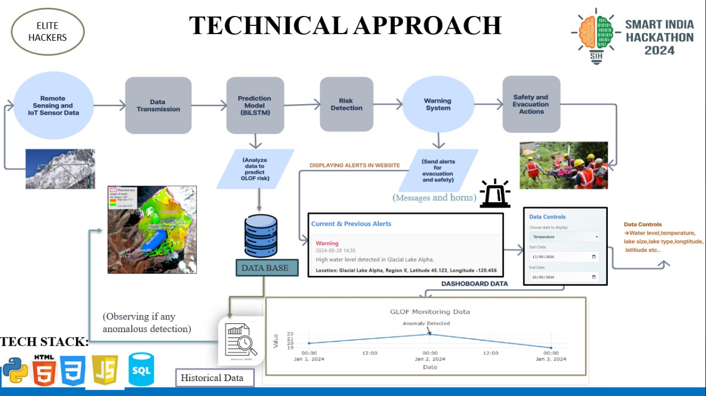

<div align="center">

# 🌊 GLOF Early Warning System

[](LICENSE)
[](https://www.python.org/)
[](https://flask.palletsprojects.com/)

</div>

---

## 🏔️ Introduction
Glacial Lake Outburst Floods (GLOFs) are sudden releases of water from glacial lakes, often triggered by natural events such as landslides or ice/snow avalanches. These catastrophic floods pose significant risks to downstream communities, infrastructure, and the environment, especially in mountainous regions.

## ❓ Problem Statement
Despite advances in monitoring, predicting GLOFs remains a challenge due to the complex interplay of environmental factors and the need for real-time data analysis. Traditional warning systems often lack predictive accuracy or timely alerts, leading to devastating consequences.

## 💡 Solution Overview
This project presents an end-to-end Early Warning System for GLOFs using:
- **Real-time IoT sensor data** combined with historical records
- **Deep learning (BiLSTM)** models for risk prediction
- **Automated alerting** and dashboard visualization for authorities and the public

## ⚙️ How It Works
1. **Data Collection:** Remote sensing and IoT sensors gather real-time lake and weather data.
2. **Data Transmission:** Data is sent to a central server/database.
3. **Prediction:** The BiLSTM model analyzes incoming data to predict GLOF risk.
4. **Warning System:** If risk is detected, alerts (web, messages, horns) are triggered.
5. **Evacuation Actions:** Authorities and communities are notified for rapid response.

## 🧩 Technical Challenges
- Integrating heterogeneous sensor and satellite data streams
- Ensuring robust, low-latency data transmission in remote areas
- Designing and training deep learning models for rare-event prediction
- Handling missing or noisy data in real-world conditions
- Building a scalable, user-friendly web dashboard for visualization and alerts

## 🗺️ System Architecture
> **Below is the system architecture flowchart. Please add your architecture diagram image in the appropriate location.**



---

## 🚀 Features

- 🤖 **LSTM-based Deep Learning Model** for accurate GLOF prediction
- 📊 Processes both real-time and historical data
- 🌐 **Web Interface** for easy data input & result visualization
- 🛠️ Model training, preprocessing, and prediction scripts

---

## 🗂️ Project Structure

| File/Folder           | Purpose                                                      |
|----------------------|--------------------------------------------------------------|
| `main.py`            | Flask web app entry point; routes for input, results, pages   |
| `modelpredict.py`    | Model loading, preprocessing, and prediction logic            |
| `bilstmmodel.py`     | Data preprocessing & model training script                   |
| `smot_model.py`      | Alternative data/model script                                |
| `app.py`             | (Legacy/alternate entry point)                               |
| `templates/`         | HTML templates for the web interface                         |
| `static/`            | Static files (CSS, images)                                   |
| `dataset/GLOFData.csv`| Main dataset used for model training                        |
| `*.h5`, `*.pkl`      | Trained model & preprocessing artifacts                      |

---

## ⚡ Quickstart

1. **Clone the repository:**
   ```sh
   git clone https://github.com/AkshithaReddy005/GLOF-EARLY-WARNING-SYSTEM.git
   cd GLOF-EARLY-WARNING-SYSTEM
   ```
2. **Install dependencies:**
   ```sh
   pip install -r requirements.txt
   ```
3. **Run the application:**
   ```sh
   python main.py
   ```
   The app will be available at [http://127.0.0.1:5000/](http://127.0.0.1:5000/)

---

## 💻 Usage

- Open the web interface and enter sensor data as a comma-separated string.
- The system will process the input and display GLOF prediction results.

---

## 🧩 Requirements

- Python 3.7+
- Flask
- TensorFlow
- scikit-learn
- pandas, numpy, joblib

*See `requirements.txt` for the full package list.*

---

## 🙌 Credits

Developed by **Akshitha** and contributors. For questions, open an issue or contact via the repository.

---

<div align="center">
  <sub>🌏 This project is for research and educational purposes. Stay safe! 🌏</sub>
</div>
